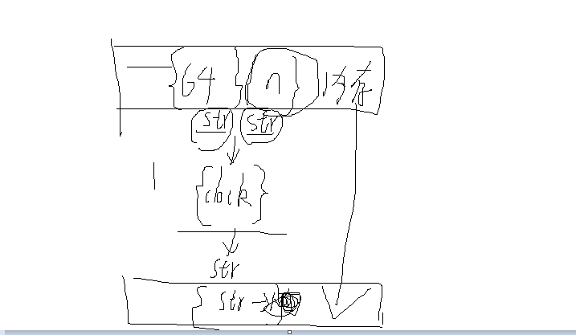
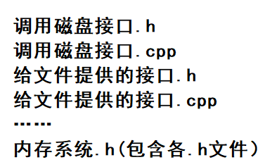

# cr2：内存系统

## 功能完整性

一般。内存的初始化，信息展示，内部运行都不错，只是时间紧迫，没有在后续对文件的操作上真正把内存调用起来

## 可读性

好，命名有小问题无伤大雅，唯一要改进的就是内容的拆分，使用函数式编程，cpp和h文件要更细致的分门别类。

记得添加头部注释

## 可维护性

差。函数式编程还没完全贯彻，不好维护。

## 可扩展性

也得等函数式编程完成后才能看出来。

## 可测试性

也得等函数式编程完成后才能看出来。

## 代码健壮性

也是一样的问题，需要到处添加数据检查，异常处理和错误处理。

## 2024年1月9日 会议记录

### 1.函数式编程问题

确定使用函数式编程，以类的形式封装各数据结构，将功能作为独立在外的函数（clock置换），其所需的输入输出解析，在内存类中提供相应的解析函数

拆分cpp，函数分门别类放入不同的cpp和h文件

### 2.数据检查问题

字符串（Qstring,std:str,chat*），以及在函数间传递的对象的指针

### 3. 等待后续在修复完成现有功能之后，正式将内存使用起来的部分设想。