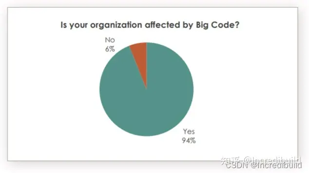
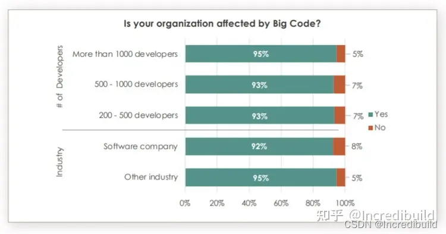
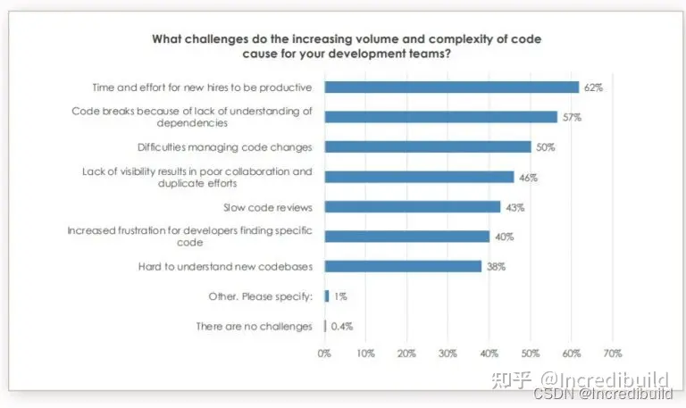

# 大型项目开发帮助-1:一线专家关于百万行代码级别项目的讨论

[原文链接](https://www.zhihu.com/question/268523561/answer/3306735033)

[原视频链接](https://www.bilibili.com/video/BV18a411d7ZY/)

根据 6 月 23 日线上交流会的投票率来看，大型代码问题，即“百万行代码（MLOC）”，似乎是一个困扰许多人的话题。

对于错过这次线上交流会的朋友们来说，我不得不重申一下：这次的讨论干货满满，各个专家都分享了各自对百万行代码项目的行业洞察。来自不同领域的顶级专家各显其能，基于自身多年处理大型代码项目的经验，给出了很多建设性的意见，因此不容错过。

我们的专家成员包括：
谷歌高级软件工程师 Titus Winters，

Red Hat容器管理高级经理 Ed Keen，

MathWorks高级系统架构师 Marc Ullman，

National Instruments首席软件架构师 David Schwartz，

Incredibuild 的开发推广工程师 Amir Kirsh。

以及我本人（Yohai West）也在主持会议，并分享了一些个人见解。

我们聚集在一起，深入讨论了与百万行代码有关的各种挑战，以及相应的有效解决方案。这些方法都是各个专家在实践中验证并归纳的干货。另外，专家们还立足当下，展望未来的行业发展。当然，以下仅是线上座谈会的部分内容，建议大家有时间可以去看看全部的讨论。

## 谁在关注大型代码项目问题？

首先，从数据开始。根据 Sourcegraph 关于大型代码的调查，参与调查的每个人都多多少少表示受到了大型代码的影响。这意味着处理数百万行代码并不仅限于个别团队，而与整个行业群体息息相关。下面的图表数据显示，94% 的受访者，不论其组织规模或开发人员的具体数量，都会受到大型代码的影响！值得一提的是，不久前，Sourcegraph 筹集了 5000 万美元，用于解决通用搜索中出现的“大型代码”问题。

图片来源: Sourcegraph

图片来源: Sourcegraph

显然，大型代码已是普遍存在的现象。接下来，我们先回顾一下百万行代码中存在的一些问题。

## 为什么这是所有人都要考虑的问题？
每次提到大型代码的话题时，对话自然会转向维护和使用大量代码所涉及的各种挑战。“大代码，大问题”，这句话依然适用于现在的处境。Sourcegraph 也调查了用户所关注的大型代码相关的挑战。

图片来源: Sourcegraph

对于这个问题，我们希望能得出一些自己的见解。因此，我们询问了讨论会中专家们的看法：

**“对比小型项目，百万行代码项目面临的特殊挑战是什么？”**

来自谷歌的 Titus Winters 负责监督 C++ 代码库（大约十亿行代码中的四分之一），他给出了一个完美的开头：

> “我认为，一旦进入百万行代码领域，最重要的事情就是如何进行扩展。”

他继续补充：“很多构建系统、CI 系统、版本控制策略、版本控制系统的固有问题可能会出现。我了解到，一些公司从较小规模发展成中型企业时，要做的第一件事，就是在签署文件之前，打开机器，下载报告副本，因为这需要耗费长达 12 个小时。如果进入百万行代码的规模，那么其中的每个步骤都很重要，且需要深思熟虑。”

构建系统就是需要考虑的重要部分，正如 Titus 所描述的：

> “你亟需找到一个好用的构建系统，我指的是没有“副作用”的构建系统。如果你的构建系统是以函数式编程语言模型为基础，而非命令式编程语言模型，这个系统就具有了一个强大的功能，即构建的每个步骤都在系统固有设置下进行沙箱处理。因此我们可以自由地对这些构建进行缓存、分发，构建速度、可依赖性和复制性也得到提升。一旦具备了这些功能，你构建的CI 管道也是可靠的……”

Titus 强调从基础层开始的重要性：

> “你必须从这些基础问题开始思考。很多人只是东拼西凑了一些有用的工具，但从来没有意识到，如何在合理的投资范围内，为开发师建立一个更好的环境。改善开发师工作体验，开发才能事半功倍。回想起在谷歌工作之前的经历，我无法形容我当时的沮丧心情，我只记得我困在所有构建难题中，紧张地计算还剩下多少时间可以进行清理。另外，如果你经常需要进行清理，这意味着你的构建系统不好。站在行业的角度，我们必须走向一个更美好的世界，必须变得更好。”

MathWorks 的 Marc Ullman（MathWorks 是 Matlab 的创建者，具有 25 年的代码工作经验）进一步讨论了大型代码项目所涉及的各种挑战：

> “这对性能、分区、稳固性来说，都是挑战不断。代码数量增多，使上层和底层操作系统都会变得紧张，同时很多工具也会不堪重负。这种负担会进一步影响 CPU，调试所需的 RAM 量。基本上，项目越来越大，问题也越来越多。”

## 处理依赖关系困难重重

National Instruments 的 David Schwartz 熟悉数百万行代码项目，他擅长处理依赖项难题：

> “如果最终造成了循环依赖关系，不幸陷入这场噩梦，你将永远无法拥有一个稳定的代码库。因为有人在这边做点变动，那边搞点破坏，修东墙补西墙，结果又破坏了其他代码。代码之间依赖度过高，那么编码任务就永无止境。你无法做到改变共享模块，同时不造成其他破坏。更可怕的是，你也不知道你破坏了什么。当然，这并不全是真实情况，你可能熟悉你正在处理的类，也了解其中的依赖关系。但是你如何在数百万行代码中进行追踪呢？编译器中的工具可能可以帮点小忙，但这远不够用。”

David 还提出了与构建相关的依赖关系，这是一个我们非常关心的话题：

> “依赖关系的另一个问题是，如果你进行了更改，并且这个变动影响了很多依赖项，那么你必须在后续构建验证中进行测试。我知道，Incredbuild 可能会有帮助，但归根结底，构建 500 万行代码不是喝杯咖啡的时间就可以完成的，它需要更多的时间，比如午餐或更多时间，尤其是在需要运行单元测试和集成测试时。因此，对于程序员来说，在某个时间点之后，工作会更加困难。除非你已经对各个依赖关系了如指掌，并尽量让各个进程独立。我认为，这就是微服务流行起来的原因。微服务的意思是：我的团队只需处理这一小段代码，尽管也有 10 万行代码，但相比之下已是小菜一碟，三分钟之内就能完成编译。如果这种方式可行，那确实不错。但当代码开始大量爆发，且依赖关系变得复杂时，事情就变得更加困难了。如何保持部件之间的独立性，如何管理不同部件之间的依赖关系，这确实是最大的挑战。”

Titus对依赖关系的观点更为大胆，他评价了 David 的洞察：

> “这听起来像是在恐惧中设计系统。如果你有足够的单元测试……并且你每小时都在做出更改，但这些都没关系，因为我们可以为每个人运行所有的单元测试。虽然说，其中一些确实不太可靠，不过，我们还是知道怎么去理解和解释。你必须根据给出的信号来预测这些步骤、程序是否安全，然后才能继续前进。”

不过，对 David 提出的保持依赖关系整洁有序的观点，Titus 深表赞同：

> “我认为你的‘不要让你的依赖性失控’是对的。”我们需要分层，需要一个循环的结构。你需要非常清楚，哪些是预期依赖项，而不是突然出现耦合……但最终，这些想法只适用于可以在午餐时间就能完成构建的项目……再一次强调，如果你的大型基础设施够好，分布式编译、并行化、缓存，所有这些都是非常实用的操作。我们只需要摆脱本地单机构建的思维定势。随着时间的推移，代码不断膨胀，而单机资源有限，两者的资源发展明显不匹配。”

## 保持概念完整性
除了依赖关系的讨论之外，Incredibuild 开发者推广师 Amir Kirsh，也具有丰富的 C++ 大型代码项目经验，他指出了另一个有意思的挑战：

> “之前大家都没提到保持概念完整性、维护文档，其实这些也是其中的一些困难。”
## 开发者的体验

Red Hat 的 Ed Keen 继续 Amir 指出的关于概念完整性的困难，并提出了他自己的看法：

> “我们还没有真正讨论的另一个领域是，开发人员的工作体验。如果你是一个新的开发人员，加入一个新的工作团队，那么你肯定需要比较长的时间去融入并熟悉这个环境。如果采用另一种方法，微服务，效果则会大不一样。新人一旦进入领域驱动设计企业，往往会更容易接受工作价值，也更能建立一种主人翁般的归属感。因为他们能很快地看到自己对业务发展的影响，因此也能更积极地适应并熟悉业务。相应地，人员流失率也较低。然而，在百万行代码中，随着时间的推移，新员工的适应时间也相应增加。业务和系统发展久远，复杂、混乱，新人一下摸不着头脑，甚至会觉得很糟糕，工作效率低下，好像每天都在浪费时间，毫无成就感可言。所有人都不希望工作拖沓，都想要高效工作。因此，我认为这是领域驱动设计带给人们的另一个改变……”

## 有效管理设计文档，保持随时更新

Amir 提到了管理文档作为维护概念完整性的一部分的问题。近年来，出现了一种非常酷炫的方法，可以解决这个难题，即：文档代码化（docs within the code）。David 对这个方法进行了介绍：

> “这是一个最近频繁提到的方法。事实上，我已经看到一些团队的成功案例，他们在 Git 存储库中创建了一个目录，无论高级设计是什么，都创建标记文件。这种方法的好处在于，你可以将该文档提交到一个分支中，然后执行一个拉取请求，你可以在设计中获得完整的拉取请求体验……此外，使用者可以在缺陷位置添加一些注释，同时设计者可以进行回复，并解决这些缺陷。这些流程也将永久保留在拉取请求中。这个过程不仅帮助你完善文档，也是一段很有意义的工作记录，将发生了什么，为什么会发生，考虑因素是什么，讨论了什么，不同的版本是什么，直到最后的版本等记录在案。这种方法无法立即给出一个完美的 Wiki 文档，尽管这是大多数人想要讨论文档，但它依然是一个很好的文档设计过程，并且与代码紧密相关。”

Titus 表示同意：

> “我认为，在过去 10 年中，谷歌为保证文档健全做出的最大改进，就是将文档按照刚才描述的方式编码，这太厉害了。”

但是，即使文档和代码化文档保持一致，也很难让文档内容保持实时更新。针对这一问题，David 做出了回复：

> “很难让你的文档与实时代码库的实际情况保持一致，因为人们对代码进行更改，而经常忘记同步更新文档……因此很难保证文档的准确性，因为它经常跟不上变化。所以许多人更喜欢用代码来记录。”

Amir 强调 Wiki 是处理文档更新的一种潜在策略：

> “在某些情况下，不一定是设计文档，但某些文档是在 Wiki 环境中维护的，任何人都可以维护该文档。如果有一些过时的内容，任何人都可以进行更改”
“如果他们这么做了……” Titus 接着 Amir 的观点继续说，“关键点就在于‘如果’，你觉得呢？当然，如果有人这么去做的话，Wiki 确实会是很实用的工具。”

## 微服务可帮助应对大型代码项目
我们谈到了很多挑战，但解决方案呢？

ITProToday 发布了一篇关于大型代码的文章，其中提出了微服务可帮助管理大型代码项目的观点：“尽管微服务和大型代码很少放在一起讨论，但我一直感觉，在过去十年中，微服务流行的部分原因，是其有效地管理了大型代码。”

我们决定讨论一下微服务，了解各个专家对微服务和大型代码项目的感受：“这两个主题有冲突吗？如何将它们串联起来？”

Marc先声夺人，他的主张是，为大型代码提供微服务会付出代价：

> “万事万物都需要一个平衡，尽管我们也不断地在尝试利用微服务和其他形式的模块化去协助大型项目，但这都是需要付出代价的。代码库庞大，微服务数量也增加，尤其是 C++ 微服务，这与传统的独立进程微服务不同。当你动态加载内容过多，操作系统级别的限制也接踵而来。比如，Mac 上的加载时间也开始变得越来越慢，因为我们变得越来越大……Linux 现在也有同样的问题……拆分是一件好事，但当你开始对底层基础设施施加压力时，自然也会有所损失。”

David认为，人类感知极限是任何模块化背后的动机，例如微服务：

> “采用任何模块化（特别是微服务）背后的动机是，人们不能同时记住太多东西。米勒定律是一个经典的心理学原理，一个人在工作记忆中只能同时处理一定数量（7±2）的事物。微服务的思想是将任务隔离，这样就不用一次处理一百万行代码了，而是一个小得多的应用程序，且这个程序往往是独立的”。

然而，David 强调了这些微服务是如何实现的，以及分区的重要性：

> “如果分得不好，最终结果是所有这些不同的微服务都相互交错，并未真正区隔……你不能使用一个庞大的代码库，同时这个代码库又被分割成许多相互依赖的小服务。这种情况下，微服务变成了一个分布式的庞然大物，这比原来的大型整体更糟糕……所以分区真是一种艺术，你必须知道每个微服务的大小，以及从哪里准确分区。”

Titus 指出微服务发挥功效的地方：

> “需要记住的重要一点是，微服务有利于限制故障域。一旦 bug、崩溃或问题出现，微服务能很快定位错误区域，并及时修复。如果有无状态组件、子组件和服务，还能帮助微服务模式扩大规模。在单片分布式系统中，无状态子组件越多，就越能以相对较小的概念成本，创建所有组件的额外副本。但问题也不断出现，比如：快速可靠地推进有多复杂？需要多少人协调配合？推进的风险有多大？如何扩展？不过，这些问题与其他普遍出现的软件操作问题大同小异，真正有趣的问题是，微服务是如何超时运转的，以及随着使用率的增加或团队的增加，微服务又该如何运转？”

此外， Titus 还谈到了大型代码库和微服务之间的关系：

> “我认为微服务不会与大型代码库问题发生冲突。多个项目可共享同一个代码库，至少在我看来，你应该这样做。因为每个人都在相同的基础设施上进行构建，分工合作，达到规模经济的效益。我看不出这些事情之间有任何冲突。”

## 与大型代码项目息息相关的群体是谁？
我们认为，讨论百万行代码的从业群体很有意义。大型代码项目群体的关注点是什么？

Amir 结合此前担任 Comverse 首席编程官的经验，做出了回应：

> “我可以谈谈首席程序员的角色。这个职位主要有两个方面的工作，一个是执行，一个是咨询。对于执行部分，首席程序员希望所有程序员使用相同的基础结构，即统一的编程语言。我们不希望产品中出现一些新的编程语言，因为一些程序员可能突发奇想，决定用一种新语言去编写某个模块。即便这种语言很厉害，也需要团队进行后续的维护，而混乱的编程语言显然让维护工作更加困难。因此，首席程序员希望对使用的操作系统和版本有一个明确统一的界定，这是执行部分的工作。
> 
> 另一方面，首席程序员需要给出建议。因为在某种程度上，你不能命令团队去做很多事情。但是，如果你提出建议，比如在某些情况下，你会说‘我建议你这样做，我们有一些基础设施来帮助你这么做’，这样你就可以影响团队工作的方式，最终保持概念的完整性。你希望员工可以看到产品的不同角度，或不同的产品，并以类似的方式去思考工作。”

Titus 紧跟 Amir 的观点：

> “我完全同意你所说的。与随心所欲相信直觉相反，公司越大，你就越需要限制团队的选择，比如使用有限的编程语言。你有良好的基础设施，功能齐全，因此你可以集中升级编译器，而不是让成百上千个团队每五年才升级一次。这样，才能提升一致性、减少bug，并巩固性能。所以，越集中越好，大家就可以将时间集中在产品决策上，而不是基础设施决策上。”

## 瀑布式开发 vs 敏捷开发

如今，敏捷开发的概念盛行……我们咨询了专家小组下列问题：我们在做敏捷吗？瀑布式开发已经是过去式了吗？还有存在的必要吗？它是百万行代码项目的必备工具吗？

Marc 介绍了Mathworks 的工作方式：

> “Mathworks 成立之初是一家对标控制系统市场的公司，常见控制方法为连续闭合回路：外部回路用于导航，内部回路帮助稳定、平衡。因此，内外两个回路系统是必须的，我们需要导航寻找趋势和方向，同时紧密地内部循环可以帮助敏捷开发。在这些内部循环中，团队在高频循环中工作，完成实际工作，并在出现问题时迅速响应。”

Ed谈到了一些刚刚开始采用敏捷开发策略的团队：

> “几周前，我与一个团队交谈，他们现在需要转向‘新敏捷’项目。我当时的反应很震惊‘这还是敏捷还是新的概念？’所以，大家对敏捷的了解还是参差不齐，也不知道需要怎么去做或者怎么成功实现敏捷开发。不过，在市场竞争中，成功总是留给有准备的人。”

## 分支合并不及时
分支合并不及时是一个常见的问题，对于大型项目和大型团队来说，问题则更加常见和复杂。David 就这个话题发表了评论：

> “这是个人爱好的问题。我个人不喜欢将分支持续好几天以上。分支合并不及时的原因，是没有尽快提交代码。因为程序员目标太大，而且自以为可以一次完成一大堆任务，这显然是一种错误的观点。一次只做一件小事，并把它做好。不要试图在一个包含 15000 个文件的大型签入中完成所有操作，这样做结果通常不太好，而且会在合并时发生冲突，也会出现错误。相比之下，处理小事情要容易得多。所以，我尽量让开发人员在 24 小时内签入……”

Amir 补充道：

> “这里的关键词是代码重构。进行适当的重构，便于轻松实现大目标，而不是将新功能与代码重构结合在一起，这会导致分支合并不及时。”

## 展望未来

**关于百万行代码项目讨论的最后，我们想谈谈关于行业未来的话题。我们是否能为下一代大学生做好铺垫，让他们能够更勇敢、自信地面对百万行代码项目呢？**

Titus 对此有些想法：

> “我们没有教人如何阅读代码，没有教人如何加入团队，也没有教人如何工作。这个行业的工作不是坐下来写一大堆代码，而是坐下来理解一大堆代码，与团队交谈，寻找可改进的地方。我们为毕业生准备的是编程，而不是软件工程。我不知道我们能做得更好。在大学课程中，真正的实践操作，以及团队协作相对贫乏。因此，对大学生来说，实践操作显然会比较困难。我认为，大学生前期的适应阶段总是很难的，尤其是对这些初出茅庐的大学生，困难将升级。

Ed 对新员工训练营颇为期待：

> “我自己没去体验过，但我一些朋友的孩子参与了三、六个月的编码训练营，他们告诉我他们学到了很多敏捷开发的实践经验，也了解了很多关于团队合作的技巧。”

但 Titus 对新员工训练营有点悲观：

> “我还是有点担心。编码新员工训练营中的团队与现实工作环境中的团队还是有所差别。试想一下，这是一个没有任何基础的团队，而且团队中的每个人都是新成员，这种情况有多罕见？所以现实工作和训练营很不一样。实际的工作团队中，员工的资历参差不齐，而且会逐渐变化……对于编码新手训练营，我还是有一些看法，这种训练不太注重评估和理论，而更注重团队合作和实践。关于这两点，也可以说很多。我认为我们两者都需要，但即便如此，这与你实际第一天工作需要的技能还是不同。”

Marc 接着说：

> “我们发现最有用的是实习，学生们可以参与（谷歌也有实习项目），并获得在大公司工作的经验。了解看看这些工作是什么，项目是如何完成的。除非你参与研究生项目，且有相关经验，不然很难在大学环境中真正去获得公司的工作经验。

Amir 强调了阅读代码的重要性：

> “在接触大型代码库之前，阅读代码是基本功。Titus 刚才提到了这一点，我让学生必须阅读更多的代码。学会有效阅读代码至关重要，因为他们不仅要会写新代码，还要会修改代码……因此，这是他们需要为百万行代码项目所做的准备。”

Amir 总结道：

> “我们总是向未来一代承诺，以后会更容易，但我不确定这是真是假，因为未来很有可能会更复杂”。