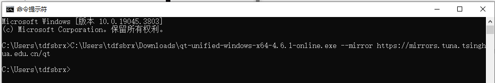
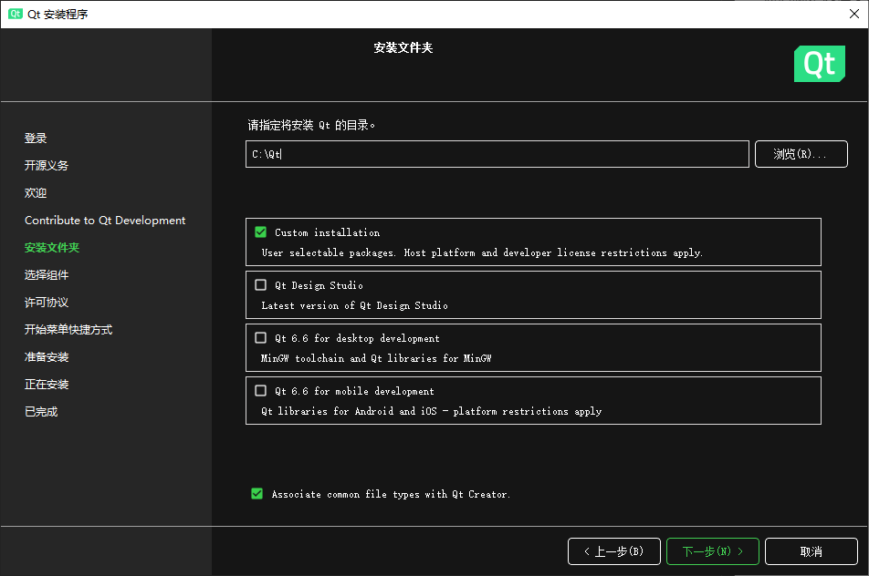
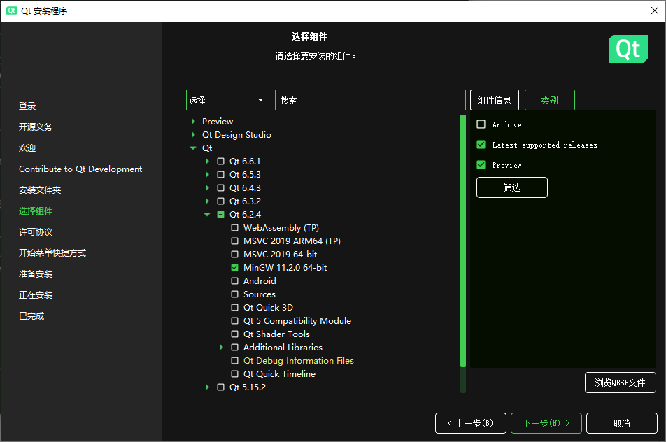

# QT安装教程

使用文件夹下提供的安装包。

打开cmd，将安装包拖入cmd，打一个空格，输入“ --mirror https://mirrors.tuna.tsinghua.edu.cn/qt ” ，回车。

此时安装程序打开，首先使用邮箱注册qt账户。

接下来一路下一步，中间会提示你是否要帮助改进，随便选。

然后就是选择安装目录：

选个自己喜欢的安装目录，直接下一步

我们使用Qt 6.2.4 版本，点开下拉菜单，只保留 MinGW 11.2.0 64-bit ，其他全部取消勾选，有需要再装。

一路下一步，提示你有4个多G要装，等待安装完成。