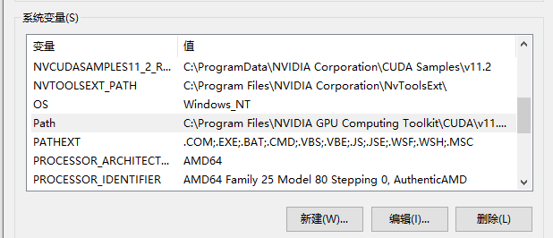

# vscode配置教程

## 1. 安装插件

需要插件：

* C/C++
* C/C++ Extension Pack
* CMake
* CMake Tools
* Qt Configure
* Qt tools

## 2. 配置环境变量

打开系统环境变量Path：

添加如下两条：

E:\QT\Tools\mingw1120_64\bin
E:\QT\Tools\CMake_64\bin

（修改为自己的路径）

## 新建项目

项目已经建立完毕。你不必新建项目，但要走一遍 配置Qt安装目录 和 配置CMake 的流程。

### 配置Qt安装目录 

ctrl+shift+p打开命令面板，输入：

    >QtConfigure:Set Qt Dir

指定你的Qt安装目录。

### 创建Qt项目

输入：

    >QtConfigure:New Project

新建项目名称、选择编译套件（选mingw），选择构建工具（选cmake），是否带ui文件（选yes）。

这时候愚蠢的cmake会默认给你搞qt5，我们要改成qt6。因此找到项目根目录下的CMakeLists.txt，修改如下：

找到

    find_package(Qt5 COMPONENTS Widgets REQUIRED)

改成
    
    find_package(Qt6 COMPONENTS Widgets REQUIRED)。

找到

    target_link_libraries(${PROJECT_NAME} PRIVATE Qt5::Widgets)

改成

    target_link_libraries(${PROJECT_NAME} PRIVATE Qt6::Widgets)

保存。

### 配置CMake

ctrl+shift+p打开命令面板，输入：

    > CMake:select a kit

选择你的编译套件。应该是GCC 11.2.0 x86_64-w64-mingw32。如果无选项可以使用Qt:Scan for Qt kit搜索，或重启vscode再搜索再选择。

## 运行

直接去main.cpp里面按F5运行。应该会跳出来一个窗口。

什么？你说上面include全是红波浪线？别管，不影响运行。

## 打开UI设计器

ctrl+shift+p打开命令面板，输入：

    > QtConfigure:Open Qt Designer
